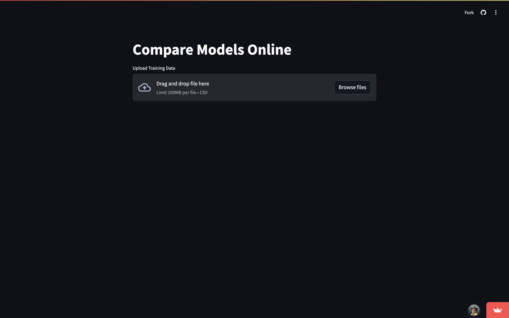
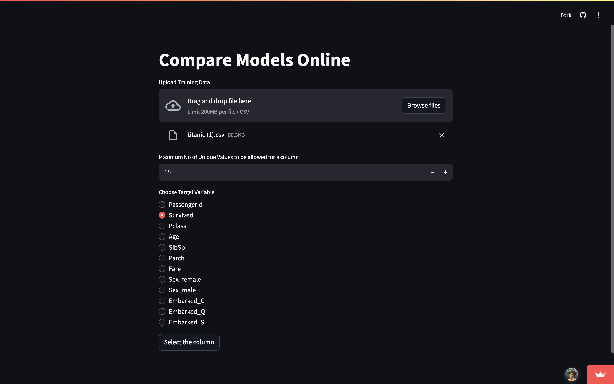
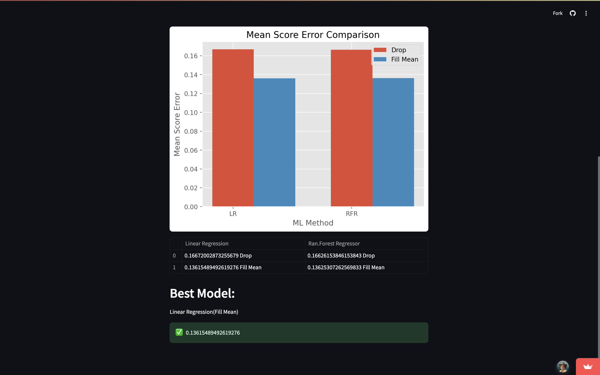

# 🤖 Machine Learning Model Comparison

This application compares the performance of different data handling strategies and machine learning models on a given dataset. It applies two primary methods to handle missing data:

- **Imputation** using mean values  
- **Elimination** of rows with missing values

Then it trains and evaluates two models:

- **Linear Regression**  
- **Random Forest Regressor**

All categorical features are one-hot encoded for compatibility with machine learning models. The application calculates and displays the **Mean Squared Error (MSE)** for each combination of preprocessing method and model.

---

## 🚀 Features

- 📊 One-hot encoding for categorical data  
- 🧹 Handles missing values via imputation and elimination  
- 🔍 Compares Linear Regression and Random Forest  
- 📉 Automatically selects the model with the lowest MSE  

---

## 🌐 Live Demo

👉 [Try it here](https://modelcomparing.streamlit.app/)

---

## 📸 Screenshots

### 🧠 Input Dataset & Options  

### 📈 Model Evaluation Results  

---

## 🛠️ Tech Stack

- Python  
- scikit-learn  
- pandas  
- Streamlit  

---
